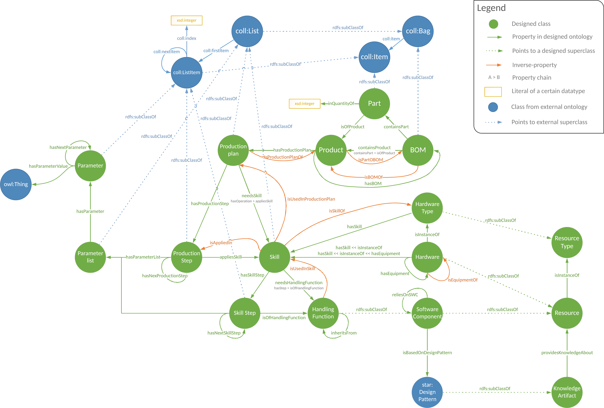

# COBOT Ontology



An OWL ontology was designed for the COBOT use case based on
accessible data, documentation and multiple interviews with a domain expert. It aims to
cover the field of collaborative robots in manufacturing, from the bills of materials and
process plans for manufacturing a product to the concrete implementation of a process
with robots and their capabilities and equipment.

**Use case:** The COBOT use case is concerned with the challenge of low utilization and limited
awareness of manufacturing technology in the Aspern pilot factory, which is an Austrian
learning and experimentation facility. The factory provides access to a range of industrial
machines, including collaborative robots. However, the detailed capabilities of these
robots are unknown to potential users due to factors such as limited public availability,
contextual dependence, and continuous evolution.

The key approach is the construction of a knowledge graph, which begins with designing a
domain ontology and integrating heterogeneous data into a unified representation.

## Description

The scope of this ontology ranges from manufactured products, manufacturing processes to robots and
equipment used in those processes. 

A manufactured `Product` may have a `BOM` (Bill of Materials) associated with it, which is a description of
atomic parts and their required quantity for assembling the corresponding `Product`. A manufactured `Product`
might additionally have a `Production Plan` associated with it. A `Production Plan` represents an ordered list
of `Production Steps` for manufacturing the associated `Product`, whereas a `Production Step` represents a certain
`Skill` being applied given a number of input `Parameters`. A `Skill` is an activity of higher granularity, e.g.
transporting a small object from location A to B, or picking and placing an object. Such a `Skill` could be part
of the `Production Plan` of an electronic `Product`, where a transistor has to be picked from a storage box and
placed into a certain drilling hole of a printed circuit board. A `Skill` is composed of atomic `Handling Functions`
such as pick, place and approach. `Software` might be required to implement `Handling Functions` and `Skills` for a
`Hardware entity`.

This ontology mainly focuses on `Robots` and hardware equipment for `Robots` such as `End Effectors` and `Sensors`.
The COBOT ontology distinguish between the physically existing `Hardware` and abstract `Hardware Types`. The concrete
[Franka Emika](https://www.franka.de/) `Robot` at the pilot factory is of the `Robot Type` "Franka Emika Panda". A `Robot`
itself has usually a limited number of `Handling Functions`, but those can be extended by equipping the concrete `Robot`
with compatible `End Effectors` and `Sensors`. Consequently, a `Robot` might be able to perform more `Skills`. The
Franka Emika `Robot` at the pilot factory can perform `Handling Functions` such as move and approach, which however are
not sufficient to perform the aforementioned pick & place `Skill`. The `Robot` must be equipped with an `End Effector`
that provides pick and place among other `Handling Functions`. `Grippers` (e.g. Robotiq 2F-85) and vacuum systems
(e.g. Robotiq Airpick) are examples for such `End Effectors`.

## Data

Sample data has been curated for this ontology, which can be found in the [data](data) folder. The [data/pilot-data.ttl](data/pilot-data.ttl)
data originates from interviews with stakeholders in the pilot factory. The [data/coboticsworld-cobots.trig](data/coboticsworld-cobots.trig)
data originates from scrapping information from the now disfunct website coboticsworld.com.

## Citation

```bibtex
@masterthesis{haller23,
  title={Semantics-Based Exploratory Search on Manufacturing Knowledge},
  author={Kevin Haller},
  year={2023},
  school={TU Wien}
}
```
